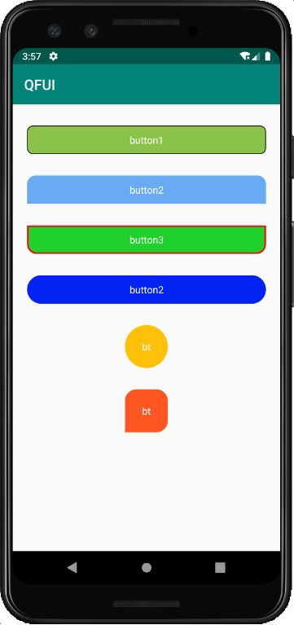

- [简介](#简介)
- [引入方式](#引入方式)
- [使用](#使用)
- [方法介绍](#方法介绍)
- [效果图](#效果图)

### 简介
    QFRoundButton是圆角button,支持设置圆角大小，分开设置每个角，边框颜色,宽度,背景色以及按下的透明度。

### 引入方式

### 使用 
 * java中：
   ```
        RoundButton rb=findViewById(R.id.rb);
        rb.setmBackgroundColor(Color.parseColor("#20d12c"));
        rb.setmBorderColor(Color.parseColor("#ff0000"));
        rb.setmBorderWidth(2);
        rb.setCorner(12);
        //分开设置每个角
        //rb.setCorner(0,0,12,12);
        
   ```
 * xml中：
   ```
    <com.example.imageviewlib.RoundButton
        android:id="@+id/rb"
        android:layout_width="match_parent"
        android:layout_height="40dp"
        android:layout_marginTop="30dp"
        android:layout_marginLeft="20dp"
        android:layout_marginRight="20dp"
        rb:rb_backgroundColor="#8BC34A"
        rb:rb_borderWidth="1dp"
        rb:rb_borderColor="#000000"
        rb:rb_pressAlpha="0.8"
        android:textColor="#ffffff"
        android:text="button1"/>
   ```
### 方法介绍 

   | 方法名                    | 作用                   | 备注        |
   | :------------------------| -----------------------|------------|
   | setCorner(int corner)    | 整体设置圆角大小         |
   | setCorner(int mTopLeft,int mTopRight,int mBottomLeft,int mBottomRight)    | 分开设置每个圆角大小         |
   | setmBackgroundColor(int mBackgroundColor)    | 设置背景色         |
   | setmBorderColor(int mBorderColor)    | 设置边框色        |
   | setmBorderWidth(int mBorderWidth)    | 设置边框大小         |


   | 属性名                    | 作用                   | 备注        |
   | :------------------------| -----------------------|------------|
   | rb_backgroundColor       | 设置背景色         |
   | rb_borderColor           | 设置边框色         |
   | rb_borderWidth           | 设置边框大小        |
   | rb_pressAlpha            | 设置按下透明度       |
   | rb_unClickAlpha          | 设置不可点击的透明度   |

### 效果图 
   