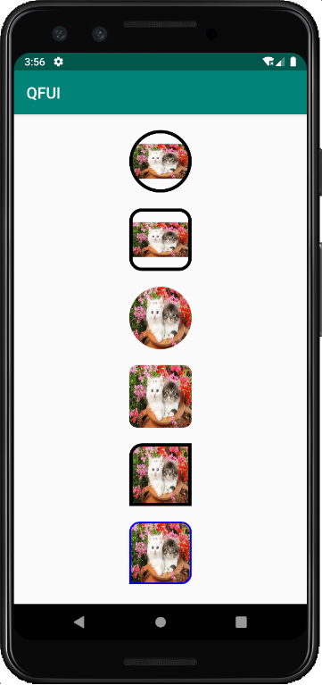

- [简介](#简介)
- [引入方式](#引入方式)
- [使用](#使用)
- [方法介绍](#方法介绍)
- [效果图](#效果图)

### 简介
    RoundImageview是圆形或圆角图片,支持设置圆形，圆角大小，分开设置每个角，边框颜色,宽度。

### 引入方式

### 使用 
   * xml中
     ```
      <com.example.imageviewlib.RoundImageView
        android:layout_width="80dp"
        android:layout_height="80dp"
        android:layout_marginTop="20dp"
        android:scaleType="fitXY"
        app:corner_radius_top_left="10dp"
        app:border_width="4dp"
        app:border_color="#000000"
        android:src="@drawable/img"/>
     ```
     
   * java中
     ```
        RoundImageView iv=findViewById(R.id.rIv);
        iv.setScaleType(ImageView.ScaleType.FIT_XY);
        // iv.setmIsCircle(true);
        // iv.setmCorner(10,10,0,10);
        iv.setmCorner(10);
        iv.setmBorderColor(Color.BLUE);
        iv.setmBorderWidth(2);
     ```
### 方法介绍 

   | 方法名                    | 作用                   | 备注        |
   | :------------------------| -----------------------|------------|
   | setmIsCircle(boolean mIsCircle)    | 设置为圆形         
   | setmCorner(int mCorner) |圆角图片，统一设置4个角大小 |
   | setmCorner(int mCornerTopLeft,int mCornerTopRight,int mCornerBottomLeft,int mCornerBottomRight) | 分开设置每个圆角大小         |
   | setmBorderColor(int mBorderColor)| 设置边框色        |
   | setmBorderWidth(int mBorderWidth)  | 设置边框大小         |

   | 属性名                    | 作用                   | 备注        |
   | :------------------------| -----------------------|------------|
   | corner_radius       | 设置圆角大小         |
   | corner_radius_top_left           | 设置左边顶部角的大小    |
   | corner_radius_top_right          | 设置右边顶部角的大小    |
   | corner_radius_bottom_left        | 设置左边底部角的大小    |
   | corner_radius_bottom_right       | 设置右边底部角的大小   |
   | border_color           | 设置边框色         |
   | border_width          | 设置边框大小        |
   | is_circle           | 设置是否为圆形       |
   | android:scaleType          | 设置图片展示类型       |
  
### 效果图 
   